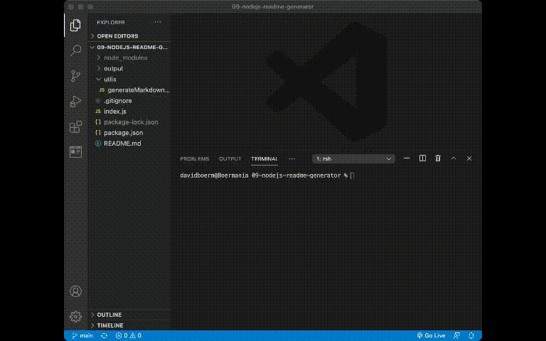

# Professional README Generator

## Description
  This node.js app utilizes the Inquirer module to prompt questions and generate a professional looking README from the user inputs.
## Table of Contents
- [Installation](#installation)
- [Usage](#usage)
- [Demo](#demo)
- [Contributing](#contributing)
- [License](#license)
- [Tests](#test)
- [Questions](#questions)
## Installation
  Requires node.js, npm, inquirer
## Usage
  Clone repo, run 'node index.js' in terminal
## Demo

## Contributing
  Ask for permission.

## License

## Tests
  no tests
## Questions
  Any Questions? Please contact me at one of the following for more information:

  [Github](https://github.com/davidboerm)  
  [LinkedIn](https://www.linkedin.com/in/davidboerm/)  
  [davidboerm@gmail.com](mailto:davidboerm@gmail.com)
